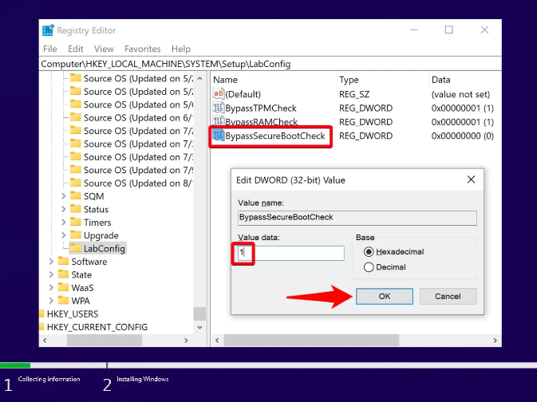

# TPM 2.0 Bypass - Windows 11 Installation
Fuck you Microsoft

***STEP 1:*** Press Shift + F10 to open Command Prompt and run the “regedit” command

***STEP 2:*** In the Registry Editor, navigate to Computer\HKEY_LOCAL_MACHINE\SYSTEM\Setup. Right-click on the “Setup” folder in your sidebar and select “New > Key”.

***STEP 3:*** Name the key “LabConfig” and add a new DWORD. After you name your folder, you can create the DWORD by right-clicking in any blank space in the main pane and selecting “DWORD (32-bit) Value”.

***STEP 4:*** Name the value “BypassTPMCheck” and set the value data to 1. It’s important the capitalization and spelling are exactly the same. You can modify the value data by double-clicking your new DWORD and changing the “Value data” text box. Press “OK” when you’re done to save the changes.

***STEP 5:*** Create another DWORD called “BypassRAMCheck” Again, make sure the capitalization and spelling is exactly the same as above.

***STEP 6:*** Change the value data to 1. Remember, you can access the value data field by double-clicking on the “BypassRAMCheck” key. Press “OK” to apply it.

***STEP 7:*** Create a new DWORD called “BypassSecureBootCheck”

***STEP 8:*** Change the value data of SecureBootCheck to 1 and press “OK”

***STEP 9:*** Close the Registry Editor and press the back button on your Windows 11 setup. You’ll find the back button in the top-left corner.

***STEP 10:*** Install Windows 11 on your unsupported hardware. You can now go through the setup process as normal. Your installer should no longer tell you your PC is incompatible.

